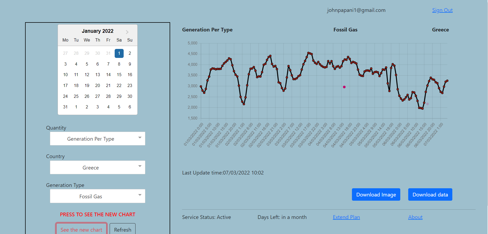
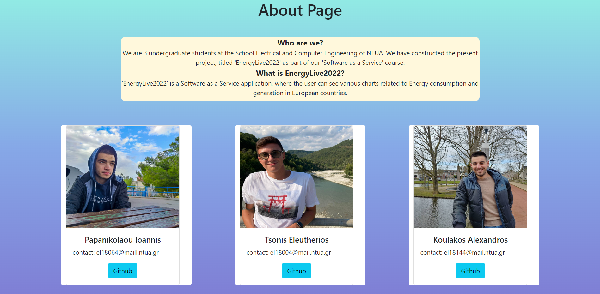

# NTUA ECE SAAS 2022 PROJECT
  
## TEAM 10

 

 Οδηγίες εγκατάστασης εφαρμογής 

1) Σε ένα terminal τρέχουμε την εντολή `./installAll.sh`, η οποία κάνει install τα απαραίτητα dependencies στους φακέλους actual-total-load, aggregated-generation-per-type, users, cascade-lists και frontend.
2) Στη συνέχεια, τρέχουμε την εντολή `./runAll.sh` η οποία θέτει σε λειτουργία τους backend servers στους φακέλους actual-total-load, aggregated-generation-per-type, users και cascade-lists.
3) Σε ενα δεύτερο terminal τρέχουμε τις εντολές `cd frontend` και έπειτα `npm run start`, έτσι ώστε να τεθεί σε λειτουργία ο frontend server.

  
The project is hosted on https://energylive2022-10.herokuapp.com/.

Σημείωση: Εξαιτίας των περιορισμών της πλατφόρμας Heroku, η εφαρμογή αδρανοποιείται όταν παραμένει ανενεργή για συγκεκριμένο χρονικό διάστημα. Ως εκ τούτου, ενδέχεται να χρειαστούν μερικά δευτερόλεπτα για να φορτώσουν οι σελίδες της.

  
  
