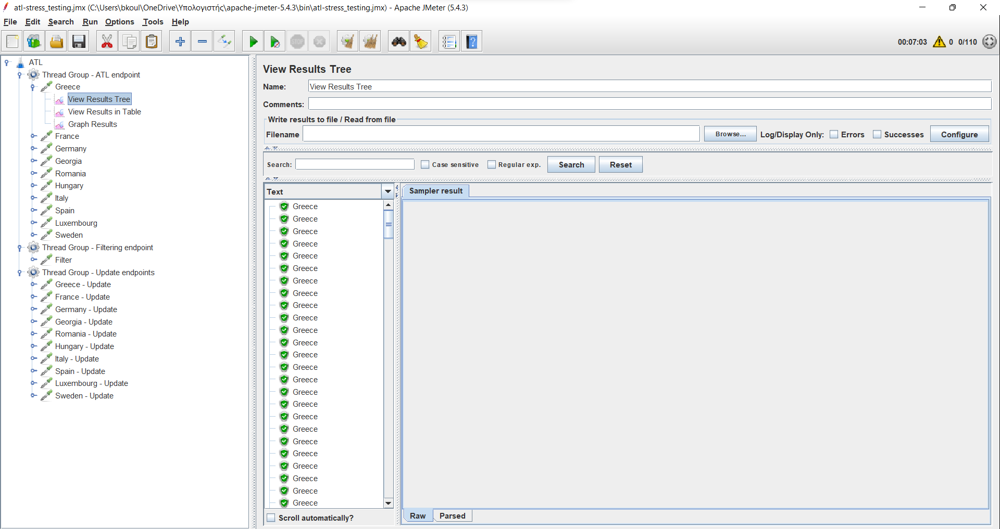
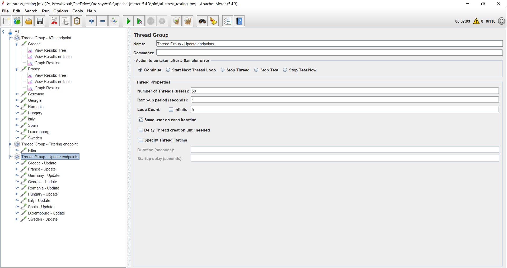

Indicatively, we test ATL endpoint with 10 different countries (Greece, Spain, Italy, Georgia, Germany, Luxembourg, France, Hungary, Romania and Sweden). We test UPDATE endpoint with the same countries (Greece, Spain, Italy, Georgia, Germany, Luxembourg, France, Hungary, Romania and Sweden). Date parameter is constantly set to 01-01-2022.

Number of threads is set to 50 and loop count is set to 5, which means that for the process of stress testing we suppose we have 5 sessions and in each session 50 different users access our app.

We conclude that under these conditions, ATL microservice performs as expected (all endpoints produce ``Response Code: 200`` and are marked with green colour in Apache jMeter). All details are listed in file ***atl-stress_testing.jmx*** which can only be opened via Apache jMeter.

Some screenshots of the testing process are shown below:

